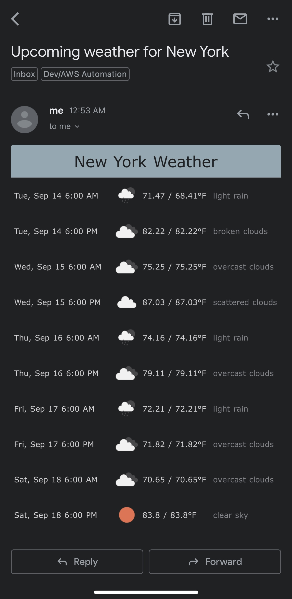

# Weather Reminder

## Overview

After the impact Hurricane Ida had on the United States' east coast, I thought it may be a good idea to receive daily weather alerts to ensure readiness.

## Example

## Setup

*AWS*

* Configure the [aws cli](https://docs.aws.amazon.com/cli/latest/userguide/cli-chap-configure.html)
* [Verify email addresses to send/receive email while in sandbox mode](https://docs.aws.amazon.com/ses/latest/DeveloperGuide/verify-email-addresses.html)
* Sign up for the [OpenWeatherApp API](https://openweathermap.org/appid) and use the provided API key to set an `OPEN_WEATHER_MAP_API` environment variable
* Create a lambda function called `weather-reminder`. Note: if your lambda is called something different, rename instances of `weather-reminder` to your lambda function name. This especially applies to build and deploy shell scripts in the `scripts` directory.
* Provide values for all environment variables mentioned in `.env.template` to the lambda function

*Local*

* Setup a virtual environment, `python3 -m venv .venv`
* Run `pip install -f requirements.txt` to install dependencies
* Run `python lambda_function.py` to test locally

## Deployment

Run `./scripts/build-deploy.sh` to build and deploy the lambda to AWS

## Impact of Hurricane Ida

* [NPR](https://www.npr.org/2021/09/13/1036665971/two-weeks-after-hurricane-ida-tens-of-thousands-in-louisiana-are-still-without-p)
* [Reuters](https://www.reuters.com/world/us/new-york-city-mayor-declares-state-emergency-after-record-breaking-rain-2021-09-02/)
* [Associated Press (AP News)](https://apnews.com/article/northeast-us-new-york-new-jersey-weather-60327279197e14b9d17632ea0818f51c)
